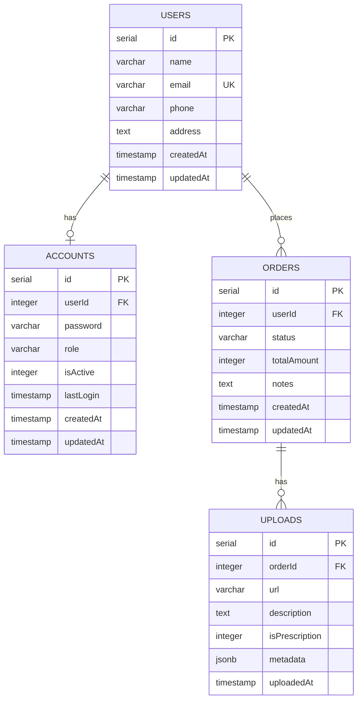

# Bavaa Medicals - Data Models

## Overview

This document describes all data models in the Bavaa Medicals application. The backend uses **Drizzle ORM** with PostgreSQL, and validation schemas are defined using **Zod**.

---

## Database Models

### Users

Represents all users in the system (customers, staff, admins).

| Field | Type | Constraints | Description |
|-------|------|-------------|-------------|
| `id` | `serial` | Primary Key | Auto-incrementing ID |
| `name` | `varchar(255)` | NOT NULL | User's full name |
| `email` | `varchar(255)` | NOT NULL, UNIQUE | User's email address |
| `phone` | `varchar(20)` | Optional | Contact phone number |
| `address` | `text` | Optional | Physical address |
| `createdAt` | `timestamp` | DEFAULT NOW() | Creation timestamp |
| `updatedAt` | `timestamp` | DEFAULT NOW() | Last update timestamp |

**Indexes:** `email_idx` on `email`

**Relations:**
- Has one `Account` (one-to-one)
- Has many `Order` (one-to-many)

---

### Accounts

Authentication and role information for users.

| Field | Type | Constraints | Description |
|-------|------|-------------|-------------|
| `id` | `serial` | Primary Key | Auto-incrementing ID |
| `userId` | `integer` | NOT NULL, FK → `users.id` | Reference to user |
| `password` | `varchar(255)` | NOT NULL | Hashed password |
| `role` | `enum` | DEFAULT 'customer' | One of: admin, staff, customer |
| `isActive` | `integer` | DEFAULT 1 | Account active status (0/1) |
| `lastLogin` | `timestamp` | Optional | Last login timestamp |
| `createdAt` | `timestamp` | DEFAULT NOW() | Creation timestamp |
| `updatedAt` | `timestamp` | DEFAULT NOW() | Last update timestamp |

**Indexes:** `user_id_idx` on `userId`

**Enums:**
- `user_role`: `['admin', 'staff', 'customer']`

**Relations:**
- Belongs to one `User` (one-to-one)

---

### Orders

Customer orders in the system.

| Field | Type | Constraints | Description |
|-------|------|-------------|-------------|
| `id` | `serial` | Primary Key | Auto-incrementing ID |
| `userId` | `integer` | NOT NULL, FK → `users.id` | Reference to customer |
| `status` | `enum` | DEFAULT 'pending' | Order status |
| `totalAmount` | `integer` | Optional | Total amount in cents |
| `notes` | `text` | Optional | Order notes |
| `createdAt` | `timestamp` | DEFAULT NOW() | Creation timestamp |
| `updatedAt` | `timestamp` | DEFAULT NOW() | Last update timestamp |

**Indexes:** 
- `user_id_idx` on `userId`
- `status_idx` on `status`

**Enums:**
- `order_status`: `['pending', 'processing', 'shipped', 'delivered', 'cancelled']`

**Relations:**
- Belongs to one `User` (one-to-one)
- Has many `Upload` (one-to-many)

---

### Uploads

File uploads associated with orders (prescriptions, documentation).

| Field | Type | Constraints | Description |
|-------|------|-------------|-------------|
| `id` | `serial` | Primary Key | Auto-incrementing ID |
| `orderId` | `integer` | NOT NULL, FK → `orders.id` | Reference to order |
| `url` | `varchar(500)` | NOT NULL | File URL/path |
| `description` | `text` | Optional | File description |
| `isPrescription` | `integer` | DEFAULT 0 | Whether this is a prescription (0/1) |
| `metadata` | `jsonb` | Optional | Additional metadata |
| `uploadedAt` | `timestamp` | DEFAULT NOW() | Upload timestamp |

**Indexes:** `order_id_idx` on `orderId`

**Relations:**
- Belongs to one `Order` (one-to-one)

---

## API Validation Schemas

These Zod schemas are used for API request/response validation in the shared package.

### User Schema

```typescript
{
  id: number
  name: string (min 2 chars)
  email: string (valid email)
  role: 'admin' | 'customer' | 'delivery'
  createdAt: Date (optional)
}
```

**Derived Schemas:**
- `createUserSchema` - for creating users (excludes id, createdAt)
- `updateUserSchema` - for updating users (all fields optional)

---

### Product Schema

```typescript
{
  id: number
  name: string (min 1 char)
  description: string
  price: number (positive)
  stock: number (integer, min 0)
  category: string
  imageUrl: string (optional, valid URL)
  createdAt: Date (optional)
  updatedAt: Date (optional)
}
```

**Derived Schemas:**
- `createProductSchema` - for creating products (excludes id, createdAt, updatedAt)
- `updateProductSchema` - for updating products (all fields optional)

---

### Order Schema

```typescript
{
  id: number
  userId: number
  items: Array<{
    productId: number
    quantity: number (positive integer)
    price: number (positive)
  }>
  status: 'pending' | 'processing' | 'shipped' | 'delivered' | 'cancelled'
  totalAmount: number (positive)
  deliveryAddress: string
  createdAt: Date (optional)
  updatedAt: Date (optional)
}
```

**Derived Schemas:**
- `createOrderSchema` - for creating orders (excludes id, createdAt, updatedAt)
- `updateOrderStatusSchema` - for updating order status

---

## Entity Relationship Diagram



### ASCII Diagram

```
┌─────────────┐       ┌─────────────┐
│    users    │       │  accounts  │
├─────────────┤       ├─────────────┤
│ id (PK)     │◄──────│ userId (FK) │
│ name        │       │ id (PK)     │
│ email       │       │ password    │
│ phone       │       │ role        │
│ address     │       │ isActive    │
│ createdAt   │       │ lastLogin   │
│ updatedAt   │       │ createdAt   │
└─────────────┘       │ updatedAt   │
        │             └─────────────┘
        │
        │ 1:N
        ▼
┌─────────────┐       ┌─────────────┐
│   orders    │       │  uploads   │
├─────────────┤       ├─────────────┤
│ id (PK)     │       │ id (PK)     │
│ userId (FK) │◄──────│ orderId(FK) │
│ status      │       │ url         │
│ totalAmount │       │ description │
│ notes       │       │ isPrescript.│
│ createdAt   │       │ metadata    │
│ updatedAt   │       │ uploadedAt  │
└─────────────┘       └─────────────┘
```

---

## Application Ports

| Port | Application |
|------|-------------|
| 3000 | Server API |
| 4001 | Customer Portal |
| 4002 | Admin Portal |
| 4003 | Delivery Portal |
| 4004 | Admin Panel |
