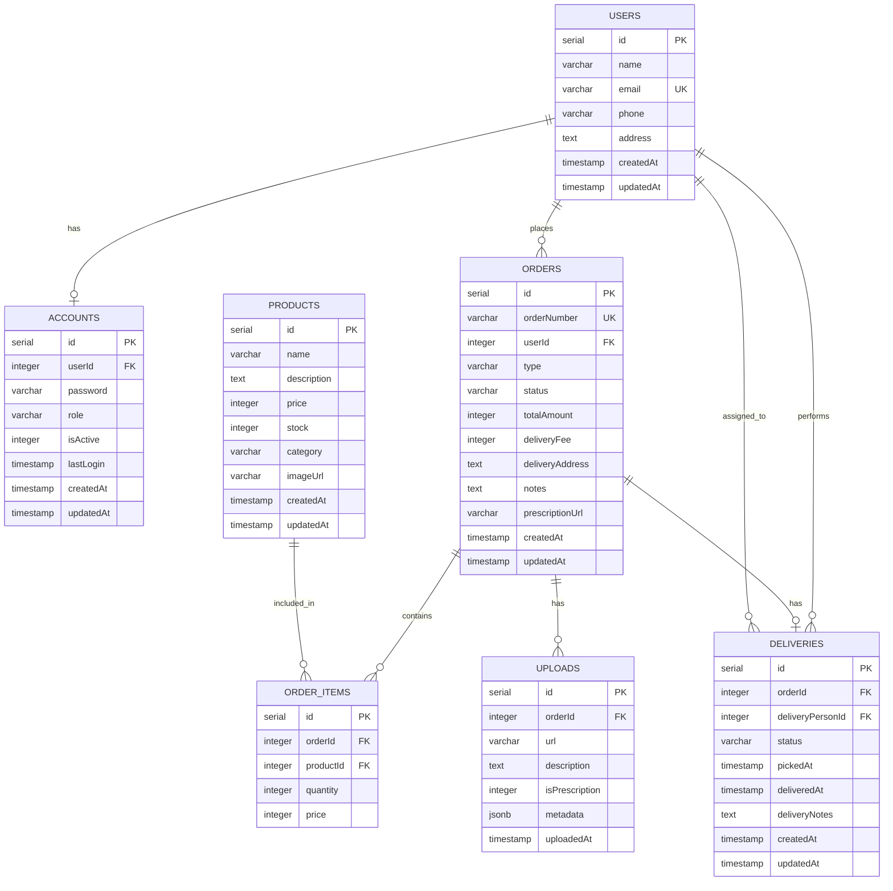

# Bavaa Medicals - Data Models

## Overview

This document describes all data models in the Bavaa Medicals application. The backend uses **Drizzle ORM** with PostgreSQL, and validation schemas are defined using **Zod**.

---

## Database Models

### Users

Represents all users in the system (customers, staff, admins, delivery personnel).

| Field | Type | Constraints | Description |
|-------|------|-------------|-------------|
| `id` | `serial` | Primary Key | Auto-incrementing ID |
| `name` | `varchar(255)` | NOT NULL | User's full name |
| `email` | `varchar(255)` | NOT NULL, UNIQUE | User's email address |
| `phone` | `varchar(20)` | Optional | Contact phone number |
| `address` | `text` | Optional | Physical address |
| `createdAt` | `timestamp` | DEFAULT NOW() | Creation timestamp |
| `updatedAt` | `timestamp` | DEFAULT NOW() | Last update timestamp |

**Indexes:** `email_idx` on `email`

**Relations:**
- Has one `Account` (one-to-one)
- Has many `Order` (one-to-many)
- Has many `Delivery` (one-to-many, as delivery person)

---

### Accounts

Authentication and role information for users.

| Field | Type | Constraints | Description |
|-------|------|-------------|-------------|
| `id` | `serial` | Primary Key | Auto-incrementing ID |
| `userId` | `integer` | NOT NULL, FK → `users.id` | Reference to user |
| `password` | `varchar(255)` | NOT NULL | Hashed password |
| `role` | `enum` | DEFAULT 'customer' | One of: admin, staff, customer, delivery |
| `isActive` | `integer` | DEFAULT 1 | Account active status (0/1) |
| `lastLogin` | `timestamp` | Optional | Last login timestamp |
| `createdAt` | `timestamp` | DEFAULT NOW() | Creation timestamp |
| `updatedAt` | `timestamp` | DEFAULT NOW() | Last update timestamp |

**Indexes:** `user_id_idx` on `userId`

**Enums:**
- `user_role`: `['admin', 'staff', 'customer', 'delivery']`

**Relations:**
- Belongs to one `User` (one-to-one)

---

### Products

Medical products available for order.

| Field | Type | Constraints | Description |
|-------|------|-------------|-------------|
| `id` | `serial` | Primary Key | Auto-incrementing ID |
| `name` | `varchar(255)` | NOT NULL | Product name |
| `description` | `text` | Optional | Product description |
| `price` | `integer` | NOT NULL | Price in cents |
| `stock` | `integer` | DEFAULT 0 | Available stock quantity |
| `category` | `varchar(100)` | Optional | Product category |
| `imageUrl` | `varchar(500)` | Optional | Product image URL |
| `createdAt` | `timestamp` | DEFAULT NOW() | Creation timestamp |
| `updatedAt` | `timestamp` | DEFAULT NOW() | Last update timestamp |

**Indexes:** `category_idx` on `category`

**Relations:**
- Has many `OrderItem` (one-to-many)

---

### Orders

Customer orders in the system.

| Field | Type | Constraints | Description |
|-------|------|-------------|-------------|
| `id` | `serial` | Primary Key | Auto-incrementing ID |
| `orderNumber` | `varchar(20)` | NOT NULL, UNIQUE | Human-readable order number |
| `userId` | `integer` | NOT NULL, FK → `users.id` | Reference to customer |
| `type` | `enum` | DEFAULT 'items' | Order type: prescription or items |
| `status` | `enum` | DEFAULT 'pending' | Order status |
| `totalAmount` | `integer` | NOT NULL | Total amount in cents |
| `deliveryFee` | `integer` | DEFAULT 0 | Delivery fee in cents |
| `deliveryAddress` | `text` | Optional | Delivery address |
| `notes` | `text` | Optional | Order notes |
| `prescriptionUrl` | `varchar(500)` | Optional | URL to prescription image |
| `createdAt` | `timestamp` | DEFAULT NOW() | Creation timestamp |
| `updatedAt` | `timestamp` | DEFAULT NOW() | Last update timestamp |

**Indexes:** 
- `user_id_idx` on `userId`
- `status_idx` on `status`
- `order_number_idx` on `orderNumber`

**Enums:**
- `order_type`: `['prescription', 'items']`
- `order_status`: `['pending', 'processing', 'ready', 'delivered', 'cancelled']`

**Relations:**
- Belongs to one `User` (one-to-one)
- Has many `OrderItem` (one-to-many)
- Has many `Upload` (one-to-many)
- Has one `Delivery` (one-to-one)

---

### OrderItems

Individual items within an order.

| Field | Type | Constraints | Description |
|-------|------|-------------|-------------|
| `id` | `serial` | Primary Key | Auto-incrementing ID |
| `orderId` | `integer` | NOT NULL, FK → `orders.id` | Reference to order |
| `productId` | `integer` | NOT NULL, FK → `products.id` | Reference to product |
| `quantity` | `integer` | NOT NULL | Quantity ordered |
| `price` | `integer` | NOT NULL | Price at time of order (cents) |

**Indexes:** 
- `order_id_idx` on `orderId`
- `product_id_idx` on `productId`

**Relations:**
- Belongs to one `Order` (one-to-one)
- Belongs to one `Product` (one-to-one)

---

### Uploads

File uploads associated with orders (prescriptions, documentation).

| Field | Type | Constraints | Description |
|-------|------|-------------|-------------|
| `id` | `serial` | Primary Key | Auto-incrementing ID |
| `orderId` | `integer` | FK → `orders.id` | Reference to order |
| `url` | `varchar(500)` | NOT NULL | File URL/path |
| `description` | `text` | Optional | File description |
| `isPrescription` | `integer` | DEFAULT 0 | Whether this is a prescription (0/1) |
| `metadata` | `jsonb` | Optional | Additional metadata |
| `uploadedAt` | `timestamp` | DEFAULT NOW() | Upload timestamp |

**Indexes:** `order_id_idx` on `orderId`

**Relations:**
- Belongs to one `Order` (one-to-one)

---

### Deliveries

Delivery tracking for orders.

| Field | Type | Constraints | Description |
|-------|------|-------------|-------------|
| `id` | `serial` | Primary Key | Auto-incrementing ID |
| `orderId` | `integer` | NOT NULL, FK → `orders.id` | Reference to order |
| `deliveryPersonId` | `integer` | NOT NULL, FK → `users.id` | Reference to delivery person |
| `status` | `enum` | DEFAULT 'picked' | Delivery status |
| `pickedAt` | `timestamp` | Optional | When order was picked up |
| `deliveredAt` | `timestamp` | Optional | When order was delivered |
| `deliveryNotes` | `text` | Optional | Notes from delivery |
| `createdAt` | `timestamp` | DEFAULT NOW() | Creation timestamp |
| `updatedAt` | `timestamp` | DEFAULT NOW() | Last update timestamp |

**Indexes:** 
- `order_id_idx` on `orderId`
- `delivery_person_id_idx` on `deliveryPersonId`

**Enums:**
- `delivery_status`: `['picked', 'on_the_way', 'delivered', 'failed']`

**Relations:**
- Belongs to one `Order` (one-to-one)
- Belongs to one `User` (one-to-one, as delivery person)

---

## Entity Relationship Diagram

---

## Application Ports

| Port | Application |
|------|-------------|
| 3000 | Server API |
| 4001 | Customer Portal |
| 4002 | Admin Portal |
| 4003 | Delivery Portal |
| 4004 | Admin Panel |
